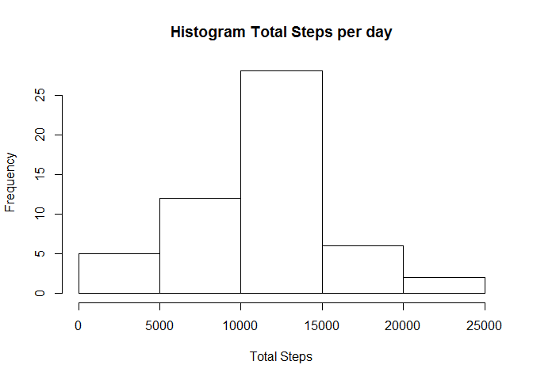
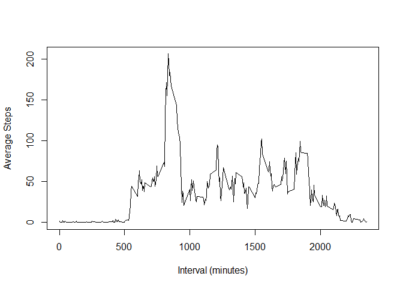
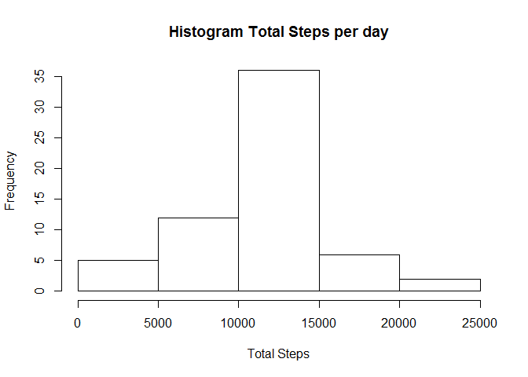
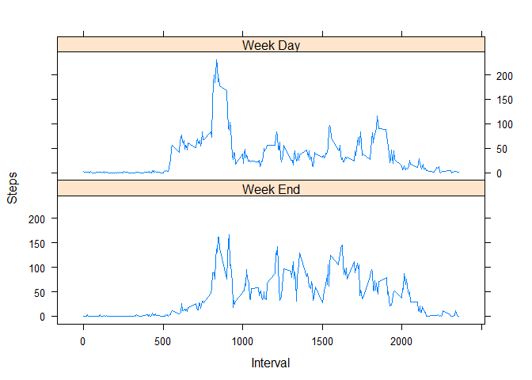

# Reproducible Research: Peer Assessment 1

## Loading and preprocessing the data

```r
library(dplyr)
```

```
## Warning: package 'dplyr' was built under R version 3.2.4
```

```
## 
## Attaching package: 'dplyr'
```

```
## The following objects are masked from 'package:stats':
## 
##     filter, lag
```

```
## The following objects are masked from 'package:base':
## 
##     intersect, setdiff, setequal, union
```

```r
library(lubridate)
library(ggplot2)
```

```
## Warning: package 'ggplot2' was built under R version 3.2.4
```

```r
library(lattice)
setwd("C:\\Users\\ABEL\\Downloads\\Coursera\\05-Report_Writing\\CodeProject-Week1\\RepData_PeerAssessment1")
url="https://d396qusza40orc.cloudfront.net/repdata%2Fdata%2Factivity.zip"
outZip="./activity.zip"
if(!file.exists(outZip)){
                download.file(url,destfile = outZip)
                unzip(zipfile = outZip,exdir=".")
        }
#Read file & Clean 
act<-tbl_df(read.csv("./activity.csv"))
# Date Format
act$date<-ymd(act$date)
summary(act)
```

```
##      steps             date               interval     
##  Min.   :  0.00   Min.   :2012-10-01   Min.   :   0.0  
##  1st Qu.:  0.00   1st Qu.:2012-10-16   1st Qu.: 588.8  
##  Median :  0.00   Median :2012-10-31   Median :1177.5  
##  Mean   : 37.38   Mean   :2012-10-31   Mean   :1177.5  
##  3rd Qu.: 12.00   3rd Qu.:2012-11-15   3rd Qu.:1766.2  
##  Max.   :806.00   Max.   :2012-11-30   Max.   :2355.0  
##  NA's   :2304
```

```r
#Clean NAs
activity<-na.omit(act)
```
## What is mean total number of steps taken per day?

```r
#Calculate total Steps 
totalDay<-tapply(activity$steps,as.factor(activity$date),sum)
hist(totalDay,main="Histogram Total Steps per day",xlab = "Total Steps")
```



```r
cat(paste0("*Mean value: ",mean(totalDay),"\n","*Median value: ",median(totalDay),"\n"))
```

```
## *Mean value: 10766.1886792453
## *Median value: 10765
```

## What is the average daily activity pattern?

```r
#Calculate the interval mean across the days.
meanDaily<-tapply(activity$steps,activity$interval,mean)
plot(meanDaily,x=unique(activity$interval),type="l",xlab="Interval (minutes)",ylab="Average Steps")
```


## Imputing missing values

```r
# The number of rows with NA 
NAs<-nrow(act)-nrow(activity)
print (paste0("The number of rows with NAs is ",NAs))
```

```
## [1] "The number of rows with NAs is 2304"
```
We will replace the NAs by the mean calculated in previous section for each 5 minute interval.

```r
# Creating a copy of the data
act2<-act
for (i in 1:nrow(act)){
     if(is.na(act$steps[i])){
             act2$steps[i]<-meanDaily[as.character(act$interval[i])]
     }   
}

totalDay<-tapply(act2$steps,as.factor(act2$date),sum)
hist(totalDay,main="Histogram Total Steps per day",xlab = "Total Steps")
```



```r
cat(paste0("*Mean value: ",mean(totalDay),"\n","*Median value: ",median(totalDay),"\n"))
```

```
## *Mean value: 10766.1886792453
## *Median value: 10766.1886792453
```
As it can be seen in previous paragraphs the difference in mean and median is very low, as well as the histogram.

## Are there differences in activity patterns between weekdays and weekends?

```r
act2$weekday<-factor(wday(act2$date)>=2 & wday(act2$date)<=6)
levels(act2$weekday)<- c("Week End","Week Day")

act3<-group_by(act2, interval, weekday)
meanDay<-tbl_df(summarise(act3,steps=mean(steps)))

xyplot(steps~interval | weekday, data=meanDay,layout=c(1,2),type="l",xlab = "Interval",ylab="Steps")
```


